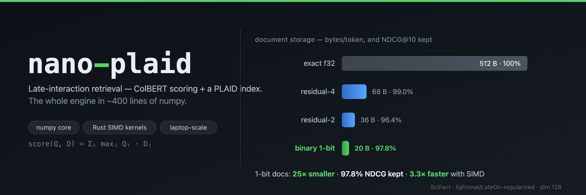

<p align="center">
  
</p>

<!-- banner.png is exported from assets/banner.svg (the editable source):
     chrome --headless --force-device-scale-factor=2 --window-size=1200,400 \
       --screenshot=assets/banner.png file://$PWD/assets/banner.svg -->

<p align="center">
  <a href="https://github.com/joe32140/nano-plaid/actions/workflows/ci.yml"></a>
  &nbsp;
  <a href="https://joe32140.github.io/nano-plaid/"><b>🎛️ SIMD school</b> — the interactive course (3 classes)</a>
</p>

# nano-plaid

The simplest complete implementation of **late-interaction retrieval**
(ColBERT scoring + a PLAID-style two-stage index), in the spirit of
[nanoGPT](https://github.com/karpathy/nanoGPT): one readable numpy file, a
real benchmark, and every design decision measurable on a laptop.

In late-interaction retrieval a query and a document are each a *bag of token
vectors*, scored by **MaxSim** — every query token finds its best-matching
document token, and the matches are summed:

```
score(Q, D) = Σᵢ maxⱼ  Q[i] · D[j]
```

This is much more accurate than single-vector dense retrieval, and much more
expensive to serve naively: a corpus is *hundreds of vectors per document*.
Everything interesting in this repo is about closing that gap — approximating
exhaustive MaxSim without touching every document token in float32.

## the arc

[`nanoplaid.py`](nanoplaid.py) (~400 lines, numpy is the only dependency)
builds up the full system in stages, each one a measurable trade of quality
vs speed vs storage:

0. **Exhaustive MaxSim** — exact, slow, the reference for everything else
1. **k-means centroids** — every corpus token gets a nearest-centroid id
2. **residual compression** — token ≈ centroid + quantized residual
   (nbits ∈ {2, 4}: 7.5×–14× smaller than float32)
3. **binary compression** — token ≈ its sign bits (25× smaller), scored by an
   int8 query through the `2P − T` identity, no decompression
4. **the index** — centroids + codes + inverted file + compressed payload
5. **two-stage search** — probe centroids for candidates, rank them with
   centroid scores alone, exactly rescore only the top `n_full`

## quickstart

```bash
pip install numpy             # that's the whole engine
python nanoplaid.py           # self-test on synthetic data
python eval.py data/toy       # committed multi-domain toy — no downloads, ~30 MB
```

`data/toy` is a small slice of four [NanoBEIR](https://huggingface.co/collections/zeta-alpha-ai)
domains (SciFact, NFCorpus, FiQA, Quora), encoded with `lightonai/LateOn-regularized`
and checked in as fp16, so the whole quantization-vs-quality story runs in a
minute with numpy alone. For a full dataset (needs torch) or the Rust backend:

```bash
pip install pylate            # encoder only (torch; GPU/MPS helps)
python encode.py --nano SciFact --out data/scifact   # or --download scifact
python eval.py data/scifact

maturin develop -m kernels/Cargo.toml --release --features python
python eval.py data/scifact --backend rust
```

## results

**The toy, reproducible right now** (`python eval.py data/toy`, NDCG@10 per
domain, `lightonai/LateOn-regularized`, dim 128):

| dataset | exact | residual-4 | residual-2 | binary |
|---------|------:|-----------:|-----------:|-------:|
| fiqa | 0.5974 | 0.6076 | 0.6067 | 0.5899 |
| nfcorpus | 0.3995 | 0.3889 | 0.3818 | 0.3741 |
| quora | 0.9868 | 0.9842 | 0.9835 | 0.9772 |
| scifact | 0.7602 | 0.7453 | 0.6972 | 0.7314 |
| **average** | 0.6860 | 0.6815 | 0.6673 | 0.6681 |

B/token: exact 512, residual-4 68, residual-2 36, binary 20. **Binary keeps
97.4% of exact NDCG at 1/25th the storage** — but look at the spread: 99.0% on
Quora down to 93.6% on NFCorpus. *Whether a corpus binarizes is domain-dependent*,
and this table is one `--model` flag away from testing your own. (Caveats: the
subsampled corpora make absolute NDCG unrepresentative — NFCorpus especially,
now balanced across all 50 queries — and with 50 queries residual can tie or
edge out exact on noise. It's for comparing *schemes*, not for headline numbers.)

**At scale** (full SciFact, 5,183 docs → 1.19M tokens, 300 queries, Apple M4 —
`encode.py --nano SciFact` then `eval.py`):

| scheme | build s | bytes/token | NDCG@10 | retention | p50 ms/query |
|--------|--------:|------------:|--------:|----------:|-------------:|
| exhaustive f32 | – | 512 | 0.7629 | 100% | 18 |
| residual nbits=4 | 16 | 68 | 0.7551 | 99.0% | 113 |
| residual nbits=2 | 6.7 | 36 | 0.7357 | 96.4% | 81 |
| binary (1-bit) | 3.7 | 20 | 0.7460 | 97.8% | 18 |

Binary matches exhaustive latency (18 ms) at 1/25th the storage; with the Rust
kernel (`--backend rust`) it drops to **5.7 ms — 3.3× faster than exhaustive**,
28 MB against a 610 MB float corpus.

## profiling (`eval.py --profile`)

`--profile` adds resident index memory, build time, and a per-stage latency
breakdown (probe / rank / rescore). On full SciFact:

| scheme | index MB | build s | p50 ms | probe/rank/rescore % |
|--------|---------:|--------:|-------:|---------------------:|
| exact | 610 (float corpus) | – | 18.4 | – |
| residual-4 | 85 | 16 | 113 | 0 / 0 / 99 |
| residual-2 | 47 | 6.7 | 81 | 1 / 1 / 99 |
| binary | 28 | 3.7 | 18.1 | 4 / 3 / 94 |
| binary `--backend rust` | 28 | – | 5.7 | 10 / 7 / 82 |

Two things the breakdown makes obvious. **Memory:** the binary index is 28 MB
against a 610 MB float corpus — 22×. **Where the time goes:** thanks to
centroid pruning (stage 1.5), the candidate set is small, so *exact rescore
dominates* — 82–99% of the query — exactly the shape a real product profile
has. That also means the Rust kernel now pays for itself: it attacks the
dominant cost, taking binary from 18 → 5.7 ms (3.3× under exhaustive). The
lesson is the ordering: the SIMD kernel was worthless until pruning made
rescore the bottleneck; profile first, optimize the tall bar.

`--backend rust` is **binary-only** — residual-4/residual-2 stay 113/81 ms
whichever backend you pass, because their rescore is a `decode → BLAS matmul`
and BLAS is already the fast path a hand kernel can't beat (that's rung C of
the [kernel ladder](kernels/README.md)). The 1-bit `2P−T` scoring is the only
thing worth a custom SIMD kernel.

**The knob that matters is `n_full`** — how many candidates get exact-rescored.
Since rescore dominates, it's the recall/latency dial (binary, SciFact):

| `n_full` | 128 | 256 | 512 | 1024 | 2048 |
|----------|----:|----:|----:|-----:|-----:|
| NDCG@10 | 0.642 | 0.685 | 0.726 | 0.746 | 0.750 |
| p50 ms | 3.2 | 5.3 | 9.4 | 17.7 | 34.7 |

`n_probe` (centroids probed per query token), by contrast, barely moves either —
the candidate scoring is cheap regardless, so 2–4 is plenty.

Two honest observations, both of which are the point of the repo:

- **Quality:** sign bits keep 98.5% of NDCG at 1/25th the storage — *for this
  checkpoint*. Whether a model binarizes is a property of the checkpoint and
  its dimensionality, not of the codec: the same pipeline on a dim=48 edge
  model collapses to ~6% retention, and a regularized vs unregularized
  training run of the same model differs by half a point. This is the single
  most interesting research knob here, and it is one `encode.py --model` flag
  away from your own experiments.
- **Speed:** in pure numpy on a 5K-doc corpus, the "smart" two-stage index
  *loses* to one exhaustive BLAS matmul. Clever indexing has real constant
  costs (gathers, decode, python), and BLAS is very hard to beat from
  interpreted code — which is exactly why production PLAID engines are
  systems projects. The same binary pipeline with real SIMD kernels
  ([next-plaid](https://github.com/lightonai/next-plaid)) serves this corpus
  at ~5.6ms/query vs ~21ms for its residual path. See [`kernels/`](kernels/)
  for where that speed actually comes from.

## the kernel ladder (`kernels/`)

The one inner loop that matters — int8 query × packed 1-bit docs MaxSim —
rebuilt in Rust as five rungs, from scalar reference to a fused SIMD kernel
(NEON SDOT on Apple Silicon, AVX2 masked-SAD on x86/Linux), all bit-identical,
benchmarked on the way up (spoiler: the algebraic identity alone makes things
*slower*; the memory layout and loop order are the speedup — 38× by rung 4).
Rung 5 swaps SDOT for the denser SMMLA matrix instruction, which *should* be
2× and instead ties — a measured lesson in why you don't trust a MAC count
without running it. Plus field notes on the three ways microbenchmarks lied to
us while building the production version. See [kernels/README.md](kernels/README.md).

A thin [pyo3 bridge](kernels/src/python.rs) exposes the top rung to numpy, so
`eval.py --backend rust` scores the binary stage-2 with the SDOT kernel —
identical NDCG@10 (0.7460). Because centroid pruning makes rescore the dominant
cost, swapping that stage cuts SciFact end-to-end p50 from ~18 ms to ~5.7 ms
(3.2×) — the kernel now attacks the tall bar instead of a rounding error.

## relationship to next-plaid

[next-plaid](https://github.com/lightonai/next-plaid) is the production
implementation: runtime CPU dispatch (AVX-512 VNNI / AVX2 / NEON), on-disk
formats, incremental updates, filtering, a CLI. nano-plaid is the textbook:
if you want to *change* the algorithm — a new compression scheme, a new
candidate generator, a different scoring identity — start here, measure with
`eval.py`, and port to next-plaid when it wins. The binary quantization
scheme here mirrors the one contributed to next-plaid in
[PR #155](https://github.com/lightonai/next-plaid/pull/155).

## files

```
nanoplaid.py   the entire index + search engine (numpy only)
encode.py      BEIR / NanoBEIR + ColBERT model -> token-embedding bundle (pylate)
make_toy.py    builds the committed data/toy slice (pylate; run once, not needed to use)
eval.py        NDCG@10 / latency / storage per scheme, one bundle or a directory of them
data/toy/      committed fp16 4-domain NanoBEIR slice — the zero-download demo
kernels/       the Rust SIMD ladder + optional pyo3 bridge
pyproject.toml maturin config for the optional Rust extension
```

MIT license.
